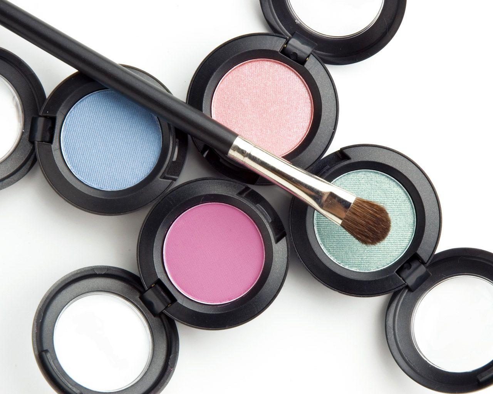

# Make Up App - React Product Management

  
*A visual snippet of the Make Up App in action.*

## Overview

Welcome to the "Make Up App" - your premier destination for managing and exploring makeup products! Whether you're a beauty enthusiast or just someone curious about the world of makeup, this application offers a seamless and captivating experience. Dive in and explore the vast world of beauty products, search for your favorites, and even add new ones.

## Features

- **User Authentication**: A secure login portal ensures only authorized access.
- **Product Management**: View, search, and manage makeup products with ease.
- **Interactive UI**: Built using React, Material-UI, and react-router-dom, the UI is both responsive and user-friendly.
- **Dynamic Search**: Discover products as you type.

## Getting Started

### Installation and Setup

1. **Clone the Repository**

```bash
git clone git@github.com:kannyg87/Phase-2-Project.git
cd phase-2-project
npm install
npm start
``````

